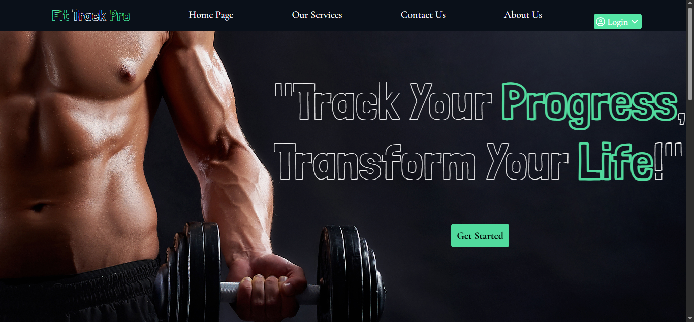

# Fit Track Pro 🏋️‍♂️📊

> **Fit Track Pro** is a modern MERN web application designed to track your exercise, yoga, and meditation routines, with a clean dashboard and interactive contact page.

---

## 🌟 Live Demo
> The app is deployed on Render (replace this with your live URL once deployed)

[**View Live App**](https://fit-track-pro.onrender.com)

---

## 📽 Project Screenshots / 

### Dashboard

---

## 🚀 Features

- ✅ User authentication with **JWT**
- ✅ Track **exercise, yoga, meditation progress**
- ✅ Interactive **contact page** with real-time email sending
- ✅ Responsive UI for **mobile, tablet, desktop**
- ✅ Future-ready **role-based dashboards** for admin/doctor/patient

---

## 🛠 Tech Stack

| Layer | Technologies |
|-------|-------------|
| Frontend | React.js, Vite, CSS3, JavaScript, React Router, React Icons |
| Backend  | Node.js, Express.js |
| Database | MongoDB Atlas |
| Auth & Security | JWT (JSON Web Tokens) |
| Email | Gmail Service |

---

## 📂 Project Structure

fit-track-pro/
├─ backend/ # Express server, routes, controllers, models
├─ frontend/ # React frontend with Vite
├─ README.md # Project documentation
├─ .env # Environment variables
└─ package.json # Backend dependencies

---

## 💻 Installation & Setup

### 1️⃣ Clone the repository

``bash
git clone https://github.com/23A95A1203/fit-track-pro.git
cd fit-track-pro ``

###2️⃣ Backend Setup
cd backend
npm install
# Create .env file and add your environment variables
npm start
Backend runs at http://localhost:9000
Frontend runs at http://localhost:5173 (Vite default)
🔑 Environment Variables

Create a .env file in the backend folder:
MONGODB_URI=<Your MongoDB Atlas URI>
PORT=9000
GMAIL_USER=<Your SMTP Email>
GMAIL_PASS=<Your SMTP Password>
JWT_SECRET=<Your JWT Secret Key>
REACT_APP_API_URL=http://localhost:9000

📝 What I Have Implemented

JWT-based user authentication

Personalized dashboard with progress tracking

Interactive contact form with popup messages

Modern, responsive UI with hover effects

Connected MongoDB Atlas for persistent data storage

Ready for future role-based features (Admin, Doctor, Patient)

📌 Future Enhancements

Progress charts for daily/weekly activities

Notifications & reminders for workouts

Payment integration for premium features

Full cloud deployment of combined frontend + backend

🤝 Contribution

Contributions are welcome!

Fork the repo

Create a branch: git checkout -b feature/FeatureName

Commit your changes: git commit -m 'Add some Feature'

Push to the branch: git push origin feature/FeatureName

Open a Pull Request

📄 License

This project is MIT Licensed.

Fit Track Pro – A professional, clean, and interactive fitness tracking web application.

